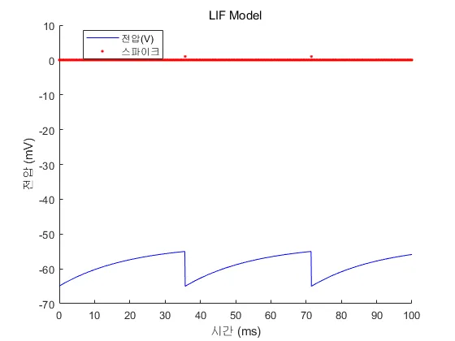

## 주요 목표
1. Leaky Integrate-and-Fire Model(LIF Model)을 Matlab 상에서 구현하고 수치적인 시뮬레이션을 진행
2. 외부에서 일정한 전류가 유입될 때 막전위가 어떻게 반응하는지 관찰
3. 외부에서 일정한 평균의 정규분포를 이루는 노이즈가 있는 전류가 유입될 때 막전위가 어떻게 반응하는지 관찰

## 1. LIF Model의 개발
우선, Matlab의 function 기능을 이용해 현재 막전위와 외부 전류를 입력하면 다음 막전위와 스파이크 여부를 반환하는 함수를 개발했다. 이 때, 시뮬레이션의 시간 간격 dt는 추후 필요에 따라 파라미터로 받는다. ([EulerLIF.m](./EulerLIF.m))

또한, 위 함수를 검증하기 위해 제일 기본적인 LIF Model의 시뮬레이션을 구현했으며, 이 결과 수업 때 다뤘던 그래프와 동일한 그래프를 얻을 수 있었다. ([BaseLIF](./BaseLIF.m)) 

## 2. 일정한 전류의 유입
1. 간단한 감을 잡기 위해 [BaseLIF](./BaseLIF.m)을 바탕으로 외부 전류에 따른 발화율을 계산했다.

    | 유입 전류(mA) | 발화율(Hz) |
    | :-------: | :-----: |
    |     1     |    0    |
    |    1.2    |   20    |
    |    1.3    |   30    |
    |   1.25    |   30    |

	- 1mA의 외부 전류에서는 스파이크가 생기지 않는다. 이는, 역치가 휴지 전위보다 10mV 높기 때문으로, 10$\Omega$의 전압에서 1mA의 외부 전류는 막전위가 10mV 높은 위치(-55mV)에 점근선을 형성하며 도달하지 못한다. 이는, 1mA의 전류가 스파이크 발생의 하한임을 의미하며, 동시에 전류 관점의 역치가 된다.
    - 1.3mA일 때와 1.25mA의 발화율이 같음을 확인할 수 있었다.
     
2. 전류-발화율 그래프
    - 1.3mA와 1.25mA에서 발화율이 같음을 확인할 수 있다. 해당 현상이 이해가 안되어 각 입력 전류 별 발화율을 각각 구해서 그 관계를 확인했다. 
    

3. 전류-발화율 그래프 개선
위의 그래프를 보면 입력 전류에 따른 발화율이 계단 함수의 형태로 단조 증가함을 알 수 있다. 이에 관해, 전체 시행 시간이 100ms를 두었으며, 1번 발화하면 10Hz, 2번 발화하면 20Hz가 나오기 때문에 위와 같은 계단 형태가 발생했을 것으로 추정했으며, 이를 검증하기 위해 전체 시간을 1000ms로 증가시켜 계산했다. 
    - 시간간격을 줄임으로서 기존의 낮은 민감도 문제를 해결했다. 이를 바탕으로 22Hz가 나오는 위해서는 입력 전류가 약 1.12mA가 되어야함을 구할 수 있었다. (**Prob1a**) 
    

4. 위에서 구한 I-F curve를 보면 Hz가 초기에는 급격하게 증가하다가, 일정 부분 이후 거의 선형적인 모습을 보임을 알 수 있다. 이를 수치적으로 이해해보면, 입력 전류와 Hz가 거시적으로는 선형적인 비례를 하나, 입력 전류에 역치가 있기에 극소 범위에서 값이 크게 요동치는 것으로 생각할 수 있다. 이를 수식적으로 보이면 대략 다음과 같을 것을 추측할 수 있다 $$\alpha \times\frac  I {I-1} \times I$$

5. 이를 바탕으로 $I = 1+\epsilon$일 때 발화율이 급격하게 증가함을 알 수 있으며, 매우 작은 발화율에 해당하는 입력 전류를 구하기 위해서는 매우 디테일한 계산이 필요함을 추측할 수 있다. 범위를 기하적으로 좁혀 나가는 방식을 통해 추정하면([Prob1b.m](./Prob1b.m)), 입력 전류가 $(1+4\cdot10^{-11} \pm 10^{-11})$ 범위 내에서 약 2Hz의 발화율이 관찰됨을 알 수 있다. 그러나, 이정도의 오차범위는 오히려 의미가 없을 수 있는데, 이는 dt가 매우 작아짐에 따라 시스템적 오류가 발생할 수 있으며, dt=0.1인 이상 $10^{-10}$ 수준의 수치는 무의미할 수 있다. (**Prob1b**)

6. 또한, 위의 관찰 결과를 바탕으로 입력 전류가 1mA보다 클 때 유한 시간 내에 스파이크가 발생함을 추정할 수 있다. (**Prob1c**)

## 3. 노이즈가 있는 전류의 유입
1. I=0으로 설정하고 정규분포의 노이즈를 추가한 시뮬레이션 환경을 구현했다([Prob1d.m](./Prob1d.m)). 이 때, 외부 유입 전류를 '항상 양수로 할 것인가(relu)'의 문제가 발생한다. 이는 실제 뉴런의 전류 흐름이 일방향인지 아닌지에 따라 다르며, 우선은 최대한의 단순성을 위해 유입 전류는 필터링이 되지 않은 순수한 정규분포를 이룬다고 가정했다. 
2. 위의 가정을 바탕으로 0~10 사이의 간격이 0.1인 표준편차를 설정하고, 각 표준편차 별 발화율을 5회 시행해 평균을 구했다. 
    
    - 이를 바탕으로 표준편차가 8.6 부근일 때 발화율이 2Hz가 나온다는 것을 알 수 있다. 
3. 위의 결과를 토대로 정확도를 높이기 위해 표준편차의 범위를 8~9 사이로 제한하고 시행 횟수를 늘렸다. 
    
    - 노이즈의 표준편차가 약 8.5일 때, 발화율이 2Hz가 나옴을 알 수 있다. (**Prob1d**)
4. 각 노이즈별 발화율을 추적했으며, 1초 동안의 발화율의 5회 시행 시 분산을 함께 표시했다. 이를 바탕으로, 발화율은 입련 전류 노이즈의 표준편차와 대체로 선형적인 관계를 갖음을 알 수 있다. (**Prob1e**, [Prob1e.m](./Prob1e.m))
       
5. 다음은 e의 그래프에서 전체 시간을 10000ms로 연장했을 때의 그래프이다. e에서의 그래프와 큰 차이는 없으나, 시간이 늘어날수록 분산이 감소한다. 이는 당연한 현상으로, 범위가 제한된 분포에서 시행이 많아질수록 분산 계산 시의 분모가 커지기에 분산이 감소할것이다. 이는, 시행 횟수가 늘어나면 더 안정적인 값을 얻을 수 있음을 의미한다. (**Prob1f**, [Prob1f](./Prob1f.m))
    
6. (**Prob1g**) 문제 상황을 구체화하자. 우선 위의 결과를 바탕으로 입련 전류의 노이즈가 클수록 발화율이 높아짐을 알 수 있다. 또한, 입력 전류의 평균이 클수록 발화율이 높아진다. 이를 조합하면, 입력 전류의 평균과 노이즈가 클 수록 발화율이 높아짐을 알 수 있으며, 이는 두 개의 독립변수가 발화율에 영향을 주는 형태의 모델을 필요로한다.

    또한, 이런 모델에서 ‘역치’의 정의도 매우 모호해진다. 입력 전류의 노이즈에 의해 발생하는 것은 상당한 임의성을 갖고, 충분히 큰 시간에 대해서는 언젠가는 결국 스파이크가 생김을 추정할 수 있다. 그렇기에, 통계적 관점에서는 단순히 스파이크의 발생 여부가 아닌, 발화율이 일정 수치 이상으로 넘어가는지, 또는 최초 발화가 몇 초 내에 일어나는지 등을 이용하는 것이 유의미하다. 심지어는, 시뮬레이션의 시간 간격이 줄어들수록 입력 전류 자체의 표준편차는 같아도 이에 의한 막전위의 누적 변화는 줄어든다. 즉, 역치를 넘기 훨씬 더 힘들어지며 종국적으로는 측정 간격이 작아질수록 발화율이 떨어지는 것을 관찰할 수 있다. 그렇기에, 발화율은 입력 평균, 표준편차, 시뮬레이션 상의 입력 간격이 종합적으로 영향을 준다. 이에, 다음과 같은 형태로 문제를 제한했다. ([Prob1g](./Prob1g.m))
    1. 시간 간격의 영향을 줄이기 위해, 실제로 사용되는 표준편차를 I의 표준편차에서 시간 간격을 나눈 값으로 사용한다.
    2. 기하분포 아이디어를 차용해, 각 조건에서 최초 발화까지 걸리는 시간을 측정한 뒤 평균을 구한다.
    3. 각 외부 전류 분포 상의 ‘평균’과 ‘표준편차’에 따른 2차원 히트맵을 그려 전반적인 양태를 확인한다.
    

    위에서 볼 수 있듯, 노이즈 표준편차와 전류 간에는 선형적인 관계가 존재한다. 즉, 둘의 적절한 선형 조합을 통해 최초 발화 시간을 추정할 수 있다.

7. 위의 히트맵 상에서 노이즈의 표준편차가 0인 경우가 노이즈가 없는 상황이다. 이를 바탕으로 비교하면, 입력 전류의 세기와 노이즈의 세기가 클수록 발화가 더 자주 발생한다. 종합하여, 입력 전류에 따라 막전위가 누적되나, 단순히 누적이 아닌 특정 역치를 넘으면 뉴런이 발화한다. 이때, 노이즈는 기존의 추세로는 불가능하지만 '값이 갑자기 튀면서' 역치를 넘을 수 있도록 하는 역할을 한다. 또한, 발화 이후에는 다시 -65mV로 돌아가므로, 일정 간격으로 노이즈 누적이 초기화된다. 이를 고려할 때, '주변 환경이 불안정할 수록 스파이크가 더 자주 발생함'을 추측할 수 있다.